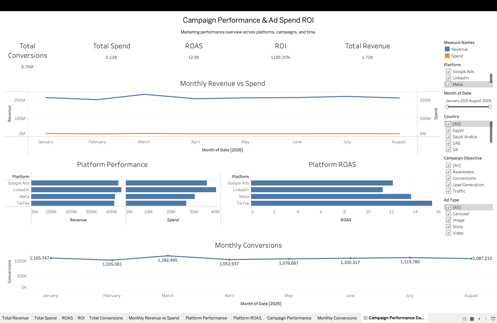

# Campaign Performance & Ad Spend ROI Dashboard

An end-to-end data analytics project for analyzing advertising campaign performance across Meta, Google Ads, TikTok, and LinkedIn.

## Dashboard
Link to the interactive dashboard -> https://public.tableau.com/views/Book1_17905283222390/CampaignPerformanceDashboard?:language=en-US&publish=yes&:sid=&:redirect=auth&:display_count=n&:origin=viz_share_link

The dashboard provides interactive analysis of:

- Revenue
- Spend
- ROAS
- ROI
- Conversions
- Platform performance
- Campaign performance
- Monthly performance

### Filters

- Date
- Platform
- Country
- Campaign Objective
- Ad Type

## Tech Stack

- Python
- Pandas
- MySQL
- SQL
- Tableau Public
- Git & GitHub
